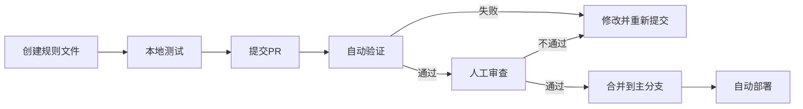

# 📋 Bot Name Generator - 产品需求文档（PRD）

> Product Requirements Document | v1.0 | 2026-04-11

---

## 🎯 产品概述

### 产品定位

一个多平台、多语言、多风格的机器人名称生成器，支持社区贡献规则，具有赛博朋克/像素风格的纯前端Web应用，可部署到GitHub Pages。

### 核心价值

- 🎲 **抽卡体验**：生成名字如同抽卡，充满趣味性
- 🌍 **多平台支持**：一次生成，适配10+个消息平台
- 🎨 **风格多样**：10种内置风格，支持社区扩展
- 🗣️ **多语言**：中英日三语界面和名称
- 🖼️ **视觉完整**：配套手绘风格头像
- 🔌 **社区驱动**：开源协作，通过PR贡献规则

### 目标用户

1. **开发者**：需要为Bot/Agent起名
2. **企业用户**：在飞书、钉钉、企微等平台部署机器人
3. **个人用户**：在Telegram、Discord、QQ等社交平台创建机器人
4. **创作者**：寻找灵感的写作者、设计师
5. **贡献者**：愿意分享命名规则的社区成员

---

## 🎯 功能需求

### F1. 名称生成系统（核心）

#### F1.1 生成机制

**用户操作流程**：
```
1. 选择风格（默认：赛博朋克）
2. 选择语言（默认：中文）
3. 点击"生成"按钮
4. 查看结果（名字 + 头像 + 多平台信息）
5. 满意 → 保存/下载
   不满意 → 重新生成
```

**生成策略**：
- **抽卡模式**：每次生成全新结果，无编辑功能
- **一键生成**：自动为所有平台生成适配信息
- **即时反馈**：生成速度 < 200ms

#### F1.2 生成算法

支持4种生成算法：

| 算法 | 说明 | 适用场景 | 示例 |
|------|------|---------|------|
| **Combination** | 前缀+词根+后缀组合 | 科技、专业风格 | Cyber + Bot + 3000 |
| **Template** | 模板填充 | 中文、可爱风格 | {形容词}{动物}助手 |
| **Markov** | 马尔可夫链生成 | 自然名称 | 基于语料库统计 |
| **Syllable** | 音节组合 | 幻想、奇幻风格 | 音节规则组合 |

#### F1.3 风格系统

**内置10种风格**：

| 风格 | 中文名 | 描述 | 头像风格 | 示例 |
|------|-------|------|---------|------|
| cyberpunk | 赛博朋克 | 未来科技，霓虹数字 | pixelArt | CyberBot3000 |
| cute | 可爱 | 萌系温暖，治愈系 | lorelei | 小兔助手 |
| professional | 专业 | 商务正式，企业级 | adventurer | AssistantPro |
| geek | 极客 | 技术范，代码艺术 | pixelArt | CodeNinja |
| fantasy | 幻想 | 奇幻魔法，冒险传说 | croodles | MysticSage |
| minimal | 极简 | 简约现代，去繁从简 | bottts | Bot |
| steampunk | 蒸汽朋克 | 维多利亚机械美学 | croodles | ClockworkBot |
| anime | 动漫 | 日系二次元 | lorelei | さくらちゃん |
| military | 军事 | 严谨高效，战术风 | adventurer | AlphaUnit |
| nature | 自然 | 生态田园，清新宁静 | croodles | ForestGuardian |

**风格扩展机制**：
- 社区可通过PR提交新风格
- 新风格需定义：名称、描述、emoji、颜色、头像映射
- 每个风格可有多个生成规则

#### F1.4 语言支持

**核心语言**（必需）：
- 🇨🇳 中文（默认）
- 🇺🇸 英文
- 🇯🇵 日文

**语言选择逻辑**：
1. 用户选择目标语言（生成该语言的名字）
2. 系统自动生成其他语言的翻译/音译
3. 根据平台规则选择合适的显示名称

**中文名称处理**：
- 使用 `pinyin-pro` 库转拼音
- 生成符合平台规则的英文ID
- 保留中文显示名称（支持中文的平台）

#### F1.5 生成结果

**包含信息**：
```json
{
  "id": "生成记录ID",
  "timestamp": "生成时间",
  "style": "风格标识",
  "displayNames": {
    "primary": "主要名称",
    "translations": {
      "zh": "中文名",
      "en": "英文名",
      "ja": "日文名"
    }
  },
  "avatar": {
    "svg": "SVG内容",
    "style": "头像风格",
    "seed": "生成种子"
  },
  "platforms": {
    // 所有平台的信息
  }
}
```

---

### F2. 多平台支持（核心）

#### F2.1 支持的平台

**10个平台 + 1个通用选项**：

| 平台 | 类别 | 需要ID | ID规则 | 难度 | 优先级 |
|------|------|-------|--------|-----|--------|
| **通用** | 通用 | ❌ | 无限制 | ⭐ | P0 |
| **Telegram** | 即时通讯 | ✅ | 必须以bot结尾 | ⭐ | P0 |
| **Discord** | 游戏社交 | ❌ | 无ID要求 | ⭐⭐ | P0 |
| **Slack** | 企业办公 | ✅ | 下划线格式 | ⭐⭐ | P0 |
| **飞书** | 企业办公 | ❌ | 系统生成AppID | ⭐⭐ | P0 |
| **钉钉** | 企业办公 | ❌ | 系统生成AppKey | ⭐⭐ | P0 |
| **企业微信** | 企业办公 | ❌ | 系统生成AgentId | ⭐⭐ | P1 |
| **微信** | 社交 | ✅ | 6-20字符 | ⭐⭐⭐ | P1 |
| **QQ** | 社交 | ❌ | 腾讯分配QQ号 | ⭐⭐⭐ | P1 |
| **QQ Bot** | 社交 | ❌ | 官方分配AppID | ⭐⭐ | P1 |
| **LINE** | 社交 | ❌ | 无ID要求 | ⭐⭐ | P2 |

#### F2.2 平台分类

**按功能分类**：

1. **通用（Generic）**：
   - 纯名称生成，无平台限制
   - 适合任意场景或仅需灵感

2. **即时通讯（Messaging）**：
   - Telegram、Discord、LINE
   - 特点：社交属性强，用户量大

3. **企业办公（Workplace）**：
   - Slack、飞书、钉钉、企业微信
   - 特点：企业场景，需要审核

4. **社交平台（Social）**：
   - 微信、QQ、QQ Bot
   - 特点：国内主流，规则严格

#### F2.3 平台特定规则

**规则类型**：

1. **显示名称规则**：
   - 长度限制
   - 允许的字符（字母、数字、中文、emoji、空格等）
   - 特殊要求

2. **用户名/ID规则**（如果需要）：
   - 格式要求
   - 必需前缀/后缀
   - 大小写敏感性
   - 允许的特殊字符

3. **生成策略**：
   - **用户指定**：Telegram、Slack、微信
   - **系统生成**：飞书、钉钉、企业微信、QQ Bot
   - **无需ID**：Discord、LINE、QQ（个人）

**示例：Telegram规则**

```json
{
  "platform": "telegram",
  "displayName": {
    "minLength": 1,
    "maxLength": 64,
    "allowChinese": true,
    "allowEmoji": true,
    "allowSpace": true
  },
  "username": {
    "minLength": 5,
    "maxLength": 32,
    "pattern": "^[A-Za-z0-9_]+bot$",
    "suffix": "bot",
    "allowedChars": ["_"]
  }
}
```

#### F2.4 UI展示逻辑

**布局结构**：
```
┌─────────────────────────────────┐
│  [风格选择] [语言选择]           │
│  [🎲 生成名称按钮]               │
└─────────────────────────────────┘

生成后：

┌─────────────────────────────────┐
│  ┌────┐                          │
│  │头像│  CyberBot3000            │
│  │    │  赛博朋克风格             │
│  └────┘                          │
│  [💾 下载] [🎲 重新生成]        │
└─────────────────────────────────┘

┌─────────────────────────────────┐
│  平台创建指南（Tab切换）         │
│  ┌───────────────────────────┐  │
│  │[通用][Telegram][Discord]..│  │
│  └───────────────────────────┘  │
│                                  │
│  当前平台：Telegram              │
│  显示名称：CyberBot3000          │
│  用户名：cyberbot3000_bot       │
│                                  │
│  创建步骤：                      │
│  1. 找到 @BotFather...          │
│  2. 发送 /newbot...             │
│  ...                            │
└─────────────────────────────────┘
```

**Tab分类显示**：
- 默认显示"通用"Tab
- 按分类组织：通用 | 即时通讯 | 企业办公 | 社交平台
- 显示验证状态（✅有效 / ⚠️警告）

**信息展示规则**：
- ✅ **需要用户指定ID的平台**：显示生成的username
- ❌ **系统生成ID的平台**：显示"系统将自动分配AppID"
- ⭕ **无需ID的平台**：只显示显示名称

---

### F3. 头像生成系统（增强）

#### F3.1 头像生成

**技术方案**：使用 **DiceBear** 库生成SVG头像

**5种头像风格**：

| 风格 | 说明 | 适配名称风格 | 特点 |
|------|------|-------------|------|
| **bottts** | 机器人风格 | 所有（默认） | 可爱，科技感 |
| **croodles** | 手绘涂鸦 | fantasy, steampunk | 手绘感强 |
| **pixelArt** | 像素艺术 | cyberpunk, geek | 复古游戏风 |
| **lorelei** | 可爱插画 | cute, anime | 萌系 |
| **adventurer** | 冒险者 | professional, military | 成熟稳重 |

**自动匹配规则**：
```typescript
const styleMapping = {
  'cyberpunk' → 'pixelArt',
  'cute' → 'lorelei',
  'professional' → 'adventurer',
  'geek' → 'pixelArt',
  'fantasy' → 'croodles',
  'minimal' → 'bottts',
  'steampunk' → 'croodles',
  'anime' → 'lorelei',
  'military' → 'adventurer',
  'nature' → 'croodles'
};
```

#### F3.2 头像特性

- **纯前端生成**：无需后端API
- **基于种子**：同一名字生成相同头像（可复现）
- **SVG格式**：体积小、可缩放、可修改
- **可导出**：支持PNG/JPEG下载（512x512）
- **即时生成**：< 100ms

#### F3.3 用户交互

```
┌─────────────────────────┐
│  ┌────────┐             │
│  │        │  BotName    │
│  │  头像  │  Style      │
│  │        │             │
│  └────────┘             │
│  [🎲 换头像] [💾 下载]   │
└─────────────────────────┘
```

**操作**：
- 🎲 **换个头像**：保持名字不变，重新生成头像
- 💾 **下载PNG**：导出高清头像（512x512）
- 🎨 **自定义**：调整背景色（可选）

---

### F4. 社区扩展系统（开源特性）

#### F4.1 扩展机制

**贡献方式**：通过GitHub Pull Request

**可扩展内容**：
1. **生成规则**：新的名称生成规则
2. **新风格**：提出并实现新的风格类别
3. **翻译**：添加新语言支持
4. **平台指南**：完善平台创建步骤

#### F4.2 规则文件格式

**规则文件要求**：

```json
{
  "id": "风格-语言-变体",               // ✅ 必需
  "style": "风格标识",                   // ✅ 必需
  "languages": ["zh", "en"],           // ✅ 必需
  "algorithm": "combination",          // ✅ 必需
  "data": { /* 生成数据 */ },         // ✅ 必需
  "author": {                          // ✅ 必需
    "name": "作者名",
    "github": "GitHub用户名"
  }
}
```

**规则命名规范**：
- 格式：`{style}-{language}-{variant}`
- 示例：`cyberpunk-zh-basic`、`cute-en-animals`
- 必须以风格名开头
- 只能包含小写字母、数字、连字符

#### F4.3 验证机制

**自动验证（GitHub Actions）**：
1. JSON Schema验证
2. 规则ID格式检查
3. 风格存在性验证
4. ID冲突检测
5. 数据质量检查（建议）

**验证通过条件**：
- ✅ 符合JSON Schema
- ✅ 规则ID唯一
- ✅ 风格已定义（或提出新风格）
- ✅ 至少支持一种语言
- ✅ 生成数据完整

**人工审查**：
- 内容质量
- 文化适宜性
- 是否重复

#### F4.4 贡献流程



---

### F5. UI/UX设计（视觉）

#### F5.1 设计风格

**主题**：赛博朋克 + 像素风

**视觉元素**：
- 🌃 **霓虹效果**：文字发光、边框光晕
- 📺 **扫描线**：CRT屏幕效果
- 🎮 **像素字体**：Press Start 2P
- ⚡ **动画效果**：按钮悬停、卡片翻转
- 🎨 **配色方案**：青色、洋红、黄色霓虹

#### F5.2 主题切换

**两种主题**：

| 主题 | 背景 | 文字 | 主色 | 效果 |
|------|------|------|------|------|
| **明亮** | 浅灰 #f0f0f0 | 深色 #1a1a1a | 青色 #00ffff | 柔和光晕 |
| **暗黑** | 深黑 #0a0a0a | 浅色 #f0f0f0 | 青色 #00ffff | 强烈光晕 |

**切换方式**：
- 页面右上角按钮
- 保存用户偏好（LocalStorage）
- 平滑过渡动画

#### F5.3 响应式设计

**断点设置**：
- 手机竖屏：< 768px
- 平板：768px - 1024px
- 桌面：> 1024px

**适配策略**：
- 移动端：单列布局，Tab折叠
- 平板：双列布局，侧边栏
- 桌面：三列布局，完整展示

#### F5.4 动画效果

**关键动画**：
1. **生成动画**：
   - 按钮按下效果
   - 加载旋转动画
   - 结果卡片翻转（翻牌效果）

2. **抽卡动画**：
   - 卡片从后方飞入
   - 旋转90度 → 0度
   - 闪光特效
   - 持续时间：0.5s

3. **交互动画**：
   - 按钮悬停：上移2px + 光晕
   - Tab切换：滑动过渡
   - 复制成功：✓ 淡入淡出

---

### F6. 数据持久化（本地）

#### F6.1 LocalStorage使用

**存储内容**：
1. **用户偏好**：
   - 主题选择（light/dark）
   - 语言选择（zh/en/ja）
   - 上次选择的风格

2. **历史记录**（最近20条）：
   - 生成的名称
   - 生成时间
   - 风格、语言信息

3. **收藏夹**（无限制）：
   - 用户收藏的名称
   - 完整的生成信息

#### F6.2 数据管理

**容量限制**：
- LocalStorage总容量：~5MB
- 历史记录：限制20条
- 收藏夹：建议上限100条

**清理策略**：
- 历史记录：FIFO（先进先出）
- 用户可手动清除
- 导出/导入功能（JSON格式）

---

## 📊 非功能需求

### NFR1. 性能要求

| 指标 | 要求 | 验收标准 |
|------|------|---------|
| 首次加载时间 | < 2s | Lighthouse |
| 生成响应时间 | < 200ms | 实测 |
| 头像生成时间 | < 100ms | 实测 |
| Lighthouse评分 | > 90 | 性能/可访问性/最佳实践/SEO |
| 无内存泄漏 | 稳定运行 | 压力测试 |

### NFR2. 兼容性要求

**浏览器支持**：
- Chrome/Edge ≥ 90
- Firefox ≥ 88
- Safari ≥ 14
- iOS Safari ≥ 14
- Android Chrome ≥ 90

**降级策略**：
- 不支持LocalStorage → 提示用户，功能降级（无历史）
- 不支持Clipboard API → 使用fallback方法

### NFR3. 可访问性（A11y）

- WCAG 2.1 AA级别
- 键盘可操作
- 屏幕阅读器支持
- 语义化HTML
- ARIA属性

### NFR4. SEO优化

- 完整的meta标签
- Open Graph标签（社交分享）
- 结构化数据（JSON-LD）
- sitemap.xml
- robots.txt

### NFR5. 国际化（i18n）

**支持语言**：
- 中文（简体）
- 英文
- 日文

**翻译覆盖**：
- UI界面文案
- 平台名称
- 创建步骤说明
- 错误提示

---

## 🚀 部署要求

### 部署平台

**GitHub Pages**：
- 免费托管
- HTTPS支持
- 自定义域名（可选）

### CI/CD流程

**GitHub Actions自动化**：
1. PR提交 → 自动验证规则
2. 合并到main → 自动构建
3. 构建成功 → 自动部署到gh-pages分支
4. 访问URL更新

### 域名和URL

**默认URL**：
```
https://{username}.github.io/bot-name-generator/
```

**自定义域名（可选）**：
```
https://botname.dev
```

---

## 📈 成功指标

### 用户指标

- **DAU**（日活用户）：> 100（第一个月）
- **生成次数**：> 1000次/周
- **收藏率**：> 30%（用户收藏生成结果）
- **重复访问率**：> 40%

### 技术指标

- **Lighthouse评分**：> 90
- **加载时间**：< 2s
- **生成成功率**：> 99%
- **错误率**：< 0.1%

### 社区指标

- **GitHub Stars**：> 100（第一个月）
- **社区贡献PR**：> 5个/月
- **规则库大小**：> 50个规则（6个月内）

---

## 🎯 MVP范围（最小可行产品）

### MVP必需功能

1. ✅ **名称生成**：
   - 3种风格：cyberpunk、cute、professional
   - 2种语言：中文、英文
   - 1种算法：combination

2. ✅ **多平台支持**：
   - 5个平台：通用、Telegram、Discord、Slack、飞书
   - 自动生成所有平台信息
   - Tab切换查看

3. ✅ **头像生成**：
   - 1种风格：bottts
   - SVG生成
   - PNG下载

4. ✅ **基础UI**：
   - 赛博朋克风格
   - 响应式布局
   - 主题切换（明/暗）

5. ✅ **社区扩展**：
   - 规则文件格式定义
   - GitHub Actions验证
   - 贡献文档

### MVP之后（增强功能）

- 更多风格（7种）
- 更多平台（5个）
- 更多头像风格（4种）
- 历史记录和收藏
- 日文支持
- 批量生成
- 分享功能

---

## 📝 附录

### A. 术语表

| 术语 | 说明 |
|------|------|
| **Bot** | 机器人，自动化程序 |
| **Agent** | 智能代理，AI助手 |
| **Platform** | 消息平台（Telegram、Discord等） |
| **Style** | 风格，名称的艺术风格和主题 |
| **Rule** | 规则，名称生成的算法和数据 |
| **Algorithm** | 生成算法（组合、模板、马尔可夫等） |
| **Seed** | 种子，用于可复现的随机生成 |
| **Username** | 用户名/Bot ID，平台特定的唯一标识 |
| **Display Name** | 显示名称，用户可见的名字 |

### B. 参考资料

1. **cc-connect项目**：https://github.com/chenhg5/cc-connect
2. **DiceBear文档**：https://dicebear.com/
3. **Telegram Bot API**：https://core.telegram.org/bots
4. **Discord Developer**：https://discord.com/developers/docs
5. **Slack API**：https://api.slack.com/
6. **飞书开放平台**：https://open.feishu.cn/

---

**文档版本**：v1.0  
**创建日期**：2026-04-11  
**更新日期**：2026-04-11  
**状态**：✅ 最终版
