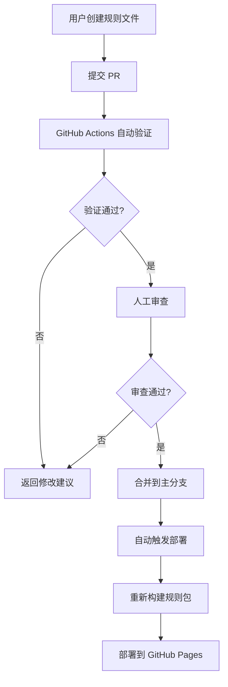

# 🤖 Bot Name Generator - 完整项目计划

> 多平台机器人名称生成器 | 社区驱动 | 赛博朋克风格

## 📋 项目概述

一个面向多个消息平台的机器人名称生成器，支持社区贡献规则、多语言、多风格，具有赛博朋克/像素风 UI。

### 核心特性

- ✨ **多平台支持**：针对 10+ 个平台展示定制化的 Bot 创建步骤
- 🎨 **智能生成**：基于风格、语言、平台特性的名称生成算法
- 🌍 **多语言**：中文、英文、日文等多语言界面和名称
- 🎭 **多种风格**：科幻、可爱、专业、极客、幻想等
- 🔌 **可扩展**：社区可通过 PR 贡献新的生成规则
- 🎮 **赛博朋克 UI**：像素风/卡通风格，明暗双主题
- 📱 **响应式**：完美适配移动端和桌面端

---

## 🏗️ 技术架构

### 技术栈

| 技术 | 选择 | 理由 |
|------|------|------|
| **前端框架** | React 18 + TypeScript | 生态成熟、类型安全 |
| **构建工具** | Vite 5 | 极速开发体验、HMR |
| **状态管理** | Zustand | 轻量、简单、高性能 |
| **多语言** | i18next + react-i18next | 业界标准 |
| **样式方案** | CSS Modules + Tailwind CSS | 模块化 + 快速开发 |
| **路由** | React Router v6 | 标准路由方案 |
| **部署** | GitHub Pages + GitHub Actions | 自动化 CI/CD |

### 项目结构

```
bot-name-generator/
├── public/                          # 静态资源
│   ├── fonts/                       # 像素字体
│   └── images/                      # 图标、背景
├── src/
│   ├── assets/                      # 项目资源
│   │   ├── styles/                  # 全局样式
│   │   │   ├── themes.css          # 主题变量
│   │   │   ├── cyberpunk.css       # 赛博朋克风格
│   │   │   └── pixel.css           # 像素风样式
│   │   └── images/
│   ├── components/                  # 组件
│   │   ├── common/                  # 通用组件
│   │   │   ├── Button/
│   │   │   ├── Card/
│   │   │   ├── ThemeToggle/
│   │   │   └── LanguageSwitch/
│   │   ├── generator/               # 生成器相关
│   │   │   ├── StyleSelector/      # 风格选择器
│   │   │   ├── NameDisplay/        # 名称展示
│   │   │   ├── RegenerateButton/   # 重新生成
│   │   │   └── NameHistory/        # 历史记录
│   │   ├── platform/                # 平台相关
│   │   │   ├── PlatformSelector/   # 平台选择器
│   │   │   ├── PlatformGuide/      # 创建步骤指南
│   │   │   └── PlatformBadge/      # 平台标签
│   │   └── avatar/                  # ✅ 头像相关
│   │       ├── AvatarDisplay/      # 头像展示
│   │       ├── AvatarStyleSelector/ # 风格选择器
│   │       └── AvatarCustomizer/   # 自定义器
│   ├── core/                        # 核心逻辑
│   │   ├── generator/               # 生成引擎
│   │   │   ├── NameGenerator.ts    # 主生成器类
│   │   │   ├── algorithms/         # 生成算法
│   │   │   │   ├── markov.ts       # 马尔可夫链
│   │   │   │   ├── combination.ts  # 组合算法
│   │   │   │   ├── template.ts     # 模板算法
│   │   │   │   └── neural.ts       # 神经网络风格（可选）
│   │   │   └── validators/         # 验证器
│   │   │       └── platformValidator.ts
│   │   ├── rules/                   # 规则系统
│   │   │   ├── RuleLoader.ts       # 规则加载器
│   │   │   ├── RuleValidator.ts    # 规则验证器
│   │   │   └── types.ts            # 规则类型定义
│   │   ├── platforms/               # 平台配置
│   │   │   ├── platformConfig.ts   # 平台元数据
│   │   │   └── platformRules.ts    # 平台命名规则
│   │   └── avatar/                  # ✅ 头像生成
│   │       ├── AvatarGenerator.ts  # 头像生成器
│   │       ├── styles.ts           # 头像风格定义
│   │       └── types.ts            # 类型定义
│   ├── data/                        # 数据文件
│   │   ├── platforms/               # 平台数据
│   │   │   └── guides/             # 创建指南（多语言）
│   │   │       ├── telegram.json
│   │   │       ├── discord.json
│   │   │       └── ...
│   │   └── locales/                 # 国际化文件
│   │       ├── en/
│   │       │   └── translation.json
│   │       ├── zh/
│   │       │   └── translation.json
│   │       └── ja/
│   │           └── translation.json
│   ├── hooks/                       # 自定义 Hooks
│   │   ├── useGenerator.ts         # 生成器 Hook
│   │   ├── useTheme.ts             # 主题 Hook
│   │   └── useHistory.ts           # 历史记录 Hook
│   ├── store/                       # 状态管理
│   │   ├── generatorStore.ts       # 生成器状态
│   │   ├── uiStore.ts              # UI 状态
│   │   └── historyStore.ts         # 历史状态
│   ├── types/                       # TypeScript 类型
│   │   ├── generator.ts
│   │   ├── platform.ts
│   │   └── rule.ts
│   ├── utils/                       # 工具函数
│   │   ├── clipboard.ts            # 剪贴板工具
│   │   ├── storage.ts              # 本地存储
│   │   ├── validators.ts           # 验证函数
│   │   └── chineseConverter.ts     # ✅ 中文转拼音工具
│   ├── pages/                       # 页面组件
│   │   ├── Home/                   # 首页
│   │   ├── Generator/              # 生成器页面
│   │   ├── Contribute/             # 贡献指南页面
│   │   └── About/                  # 关于页面
│   ├── App.tsx                     # 应用根组件
│   ├── main.tsx                    # 应用入口
│   └── vite-env.d.ts              # Vite 类型定义
├── rules/                           # 🔥 规则库（社区贡献）
│   ├── README.md                   # 规则贡献指南
│   ├── _schema.json                # 规则 JSON Schema
│   ├── built-in/                   # 内置规则
│   │   ├── cyberpunk.json
│   │   ├── cute.json
│   │   ├── professional.json
│   │   ├── geek.json
│   │   └── fantasy.json
│   └── community/                  # 社区贡献规则
│       └── .gitkeep
├── scripts/                         # 构建脚本
│   ├── build-rules.js              # 聚合规则文件
│   └── validate-rules.js           # 验证规则格式
├── .github/
│   ├── workflows/
│   │   ├── deploy.yml              # 部署工作流
│   │   └── validate-rules.yml      # PR 规则验证
│   ├── PULL_REQUEST_TEMPLATE.md   # PR 模板
│   └── ISSUE_TEMPLATE/
│       └── new-rule.md             # 新规则提交模板
├── index.html
├── package.json
├── tsconfig.json
├── vite.config.ts
├── tailwind.config.js
├── README.md                        # 项目 README
├── CONTRIBUTING.md                  # 贡献指南
└── LICENSE                          # 开源协议
```

---

## 🎯 核心功能设计

### 1. 多平台支持

基于 cc-connect 项目集成的 10 个平台：

| 平台 | 命名规则 | 特殊要求 | 推荐风格 |
|------|---------|---------|---------|
| **Telegram** | 必须以 `bot` 结尾，仅字母数字下划线 | 全局唯一，不区分大小写 | 任意 |
| **Discord** | 2-32字符，可用空格 | 无特殊后缀要求 | 任意 |
| **Slack** | 推荐用下划线 `_` 分隔 | 用户名格式 | 专业/技术 |
| **Feishu/Lark** | 支持中文 | 企业内唯一 | 中文友好 |
| **DingTalk** | 支持中文 | 企业内唯一 | 中文友好 |
| **WeChat Work** | 支持中文 | 企业内唯一 | 中文友好 |
| **Weixin** | 支持中文，微信号规则 | 6-20字符 | 中文/简短 |
| **QQ** | 数字或字母数字组合 | 5-10字符推荐 | 简短 |
| **QQ Bot** | 支持中文 | 官方平台 | 任意 |
| **LINE** | 无特殊要求 | 需要公网 URL | 任意 |

#### 平台创建指南结构

每个平台提供简洁的创建步骤（JSON 格式）：

```json
{
  "platform": "telegram",
  "icon": "telegram",
  "displayName": {
    "en": "Telegram",
    "zh": "Telegram",
    "ja": "Telegram"
  },
  "namingRules": {
    "pattern": "^[A-Za-z0-9_]+bot$",
    "suffix": "bot",
    "minLength": 5,
    "maxLength": 32,
    "description": {
      "en": "Must end with 'bot', only letters, numbers, and underscores",
      "zh": "必须以 'bot' 结尾，仅支持字母、数字和下划线",
      "ja": "'bot' で終わる必要があり、文字、数字、アンダースコアのみ"
    }
  },
  "steps": [
    {
      "title": { "en": "Find BotFather", "zh": "找到 BotFather", "ja": "BotFather を探す" },
      "description": { "en": "Search for @BotFather in Telegram", "zh": "在 Telegram 搜索 @BotFather", "ja": "Telegram で @BotFather を検索" },
      "image": "/guides/telegram/step1.png"
    },
    {
      "title": { "en": "Create Bot", "zh": "创建机器人", "ja": "ボットを作成" },
      "description": { "en": "Send /newbot command", "zh": "发送 /newbot 命令", "ja": "/newbot コマンドを送信" },
      "command": "/newbot"
    },
    {
      "title": { "en": "Set Name", "zh": "设置名称", "ja": "名前を設定" },
      "description": { "en": "Enter your bot name (display name)", "zh": "输入机器人名称（显示名称）", "ja": "ボット名を入力（表示名）" }
    },
    {
      "title": { "en": "Set Username", "zh": "设置用户名", "ja": "ユーザー名を設定" },
      "description": { "en": "Enter username ending with 'bot'", "zh": "输入以 'bot' 结尾的用户名", "ja": "'bot' で終わるユーザー名を入力" },
      "highlight": "Must end with 'bot'"
    },
    {
      "title": { "en": "Get Token", "zh": "获取 Token", "ja": "トークンを取得" },
      "description": { "en": "Save the bot token securely", "zh": "安全保存机器人 Token", "ja": "ボットトークンを安全に保存" },
      "warning": { "en": "Keep token secret!", "zh": "请妥善保管 Token！", "ja": "トークンを秘密にしてください！" }
    }
  ],
  "officialDocs": "https://core.telegram.org/bots#creating-a-new-bot",
  "difficulty": "easy"
}
```

### 2. 名称生成系统

#### 生成算法类型

```typescript
enum GenerationAlgorithm {
  COMBINATION = 'combination',    // 组合算法：前缀 + 词根 + 后缀
  TEMPLATE = 'template',          // 模板算法：基于模板填充
  MARKOV = 'markov',              // 马尔可夫链：基于统计
  SYLLABLE = 'syllable',          // 音节组合
  NEURAL = 'neural'               // 神经网络风格（可选）
}
```

#### 规则文件格式（JSON Schema）

```json
{
  "$schema": "http://json-schema.org/draft-07/schema#",
  "type": "object",
  "required": ["id", "name", "algorithm", "style", "languages", "data"],
  "properties": {
    "id": {
      "type": "string",
      "pattern": "^[a-z0-9-]+$",
      "description": "规则唯一标识"
    },
    "name": {
      "type": "object",
      "description": "规则名称（多语言）",
      "properties": {
        "en": { "type": "string" },
        "zh": { "type": "string" },
        "ja": { "type": "string" }
      }
    },
    "description": {
      "type": "object",
      "description": "规则描述"
    },
    "algorithm": {
      "enum": ["combination", "template", "markov", "syllable"],
      "description": "生成算法类型"
    },
    "style": {
      "type": "string",
      "enum": ["cyberpunk", "cute", "professional", "geek", "fantasy", "sci-fi", "steampunk", "minimal"],
      "description": "风格标识"
    },
    "languages": {
      "type": "array",
      "items": { "enum": ["en", "zh", "ja", "ko", "fr", "de"] },
      "description": "支持的语言"
    },
    "platformOptimized": {
      "type": "array",
      "items": { "type": "string" },
      "description": "针对优化的平台"
    },
    "author": {
      "type": "object",
      "properties": {
        "name": { "type": "string" },
        "github": { "type": "string" }
      }
    },
    "data": {
      "type": "object",
      "description": "生成数据（根据算法不同而不同）"
    }
  }
}
```

#### 内置规则示例：Cyberpunk（赛博朋克）

```json
{
  "id": "cyberpunk",
  "name": {
    "en": "Cyberpunk",
    "zh": "赛博朋克",
    "ja": "サイバーパンク"
  },
  "description": {
    "en": "Futuristic, tech-inspired names with a cyberpunk aesthetic",
    "zh": "未来感十足的科技风格名称",
    "ja": "サイバーパンクの美学を持つ未来的な名前"
  },
  "algorithm": "combination",
  "style": "cyberpunk",
  "languages": ["en", "zh", "ja"],
  "platformOptimized": ["telegram", "discord", "slack"],
  "author": {
    "name": "Bot Name Generator Team",
    "github": "bot-name-generator"
  },
  "data": {
    "prefixes": [
      { "value": "Cyber", "weight": 10 },
      { "value": "Nano", "weight": 8 },
      { "value": "Quantum", "weight": 7 },
      { "value": "Neural", "weight": 9 },
      { "value": "Synth", "weight": 8 },
      { "value": "Neuro", "weight": 7 },
      { "value": "Tech", "weight": 6 },
      { "value": "Digi", "weight": 7 },
      { "value": "Pixel", "weight": 6 },
      { "value": "Matrix", "weight": 8 }
    ],
    "roots": [
      { "value": "Bot", "weight": 10 },
      { "value": "Tron", "weight": 9 },
      { "value": "Core", "weight": 8 },
      { "value": "Mind", "weight": 7 },
      { "value": "Pulse", "weight": 6 },
      { "value": "Wave", "weight": 7 },
      { "value": "Node", "weight": 8 },
      { "value": "Link", "weight": 7 },
      { "value": "Mesh", "weight": 6 },
      { "value": "Grid", "weight": 7 }
    ],
    "suffixes": [
      { "value": "3000", "weight": 8 },
      { "value": "X", "weight": 9 },
      { "value": "Prime", "weight": 7 },
      { "value": "Neo", "weight": 8 },
      { "value": "Alpha", "weight": 7 },
      { "value": "Beta", "weight": 5 },
      { "value": "Core", "weight": 6 },
      { "value": "One", "weight": 7 },
      { "value": "Zero", "weight": 6 },
      { "value": "AI", "weight": 9 }
    ]
  }
}
```

#### 中文可爱风格规则示例

```json
{
  "id": "cute-zh",
  "name": {
    "en": "Cute Chinese",
    "zh": "中文可爱风",
    "ja": "中国語かわいい"
  },
  "algorithm": "template",
  "style": "cute",
  "languages": ["zh"],
  "platformOptimized": ["weixin", "qq", "feishu", "dingtalk"],
  "data": {
    "templates": [
      "{adjective}{animal}机器人",
      "{adjective}小{animal}",
      "{animal}{suffix}",
      "{prefix}{animal}助手",
      "可爱的{animal}{suffix}"
    ],
    "adjectives": ["聪明的", "可爱的", "机灵的", "萌萌的", "智慧的", "贴心的"],
    "animals": ["小猫", "小狗", "兔子", "熊猫", "企鹅", "海豚", "狐狸"],
    "prefixes": ["小", "智能", "AI", "云端"],
    "suffixes": ["助手", "宝宝", "君", "酱", "仔"]
  }
}
```

### 3. 头像生成系统

#### 为什么需要头像？

- 🎨 **视觉完整性**：名字 + 头像 = 完整的Bot形象
- 🎲 **抽卡体验**：更有趣的生成体验
- 💾 **可分享性**：头像让Bot更具象、更易分享
- 🎭 **风格匹配**：头像自动匹配名称风格

#### 头像风格

基于 **DiceBear** 库提供5种可爱/手绘风格：

| 风格 | 描述 | 适配名称风格 | 图标 |
|------|------|--------------|------|
| **bottts** | 可爱的机器人风格 | 所有（默认） | 🤖 |
| **croodles** | 手绘涂鸦风格 | Fantasy（幻想） | ✏️ |
| **pixelArt** | 像素艺术风格 | Cyberpunk, Geek | 🎮 |
| **lorelei** | 可爱插画风格 | Cute（可爱） | 🌸 |
| **adventurer** | 冒险者风格 | Professional（专业） | 🗺️ |

#### 自动风格匹配

```typescript
// 根据名称风格自动选择头像风格
const styleMapping = {
  'cyberpunk' → 'pixelArt',    // 赛博朋克 → 像素艺术
  'cute' → 'lorelei',          // 可爱 → 可爱插画
  'professional' → 'adventurer', // 专业 → 冒险者
  'geek' → 'pixelArt',         // 极客 → 像素艺术
  'fantasy' → 'croodles'       // 幻想 → 手绘涂鸦
};
```

#### 用户交互

```
┌─────────────────────────────────┐
│  ┌───────────┐                  │
│  │  🤖 头像   │  CyberBot3000   │
│  │  (256x256) │  Cyberpunk      │
│  └───────────┘                  │
│                                  │
│  [🎲 换个头像] [💾 下载PNG]     │
└─────────────────────────────────┘
```

**操作**：
- 🎲 **生成备选** - 一键生成5个不同的头像供选择
- 💾 **下载PNG** - 下载高清头像（512x512）
- 🎨 **自定义** - 调整背景色和圆角
- ♻️ **随机重生** - 完全随机生成新头像

#### 技术特点

- ✅ **纯前端** - 无需后端API，即时生成
- ✅ **SVG格式** - 体积小、可缩放、可修改
- ✅ **可复现** - 基于种子生成，同一名字可生成相同头像
- ✅ **高性能** - 缓存优化，即时渲染
- ✅ **可导出** - 支持PNG/JPEG导出

#### 实现方案

```typescript
// 生成头像
const avatarStyle = getAvatarStyleForBotStyle('cyberpunk'); // 'pixelArt'
const avatar = AvatarGenerator.generateSVG(
  seed,           // 随机种子
  avatarStyle,    // 头像风格
  {
    backgroundColor: ['#00ffff'], // 匹配赛博朋克配色
    radius: 50,   // 圆角
    size: 256     // 尺寸
  }
);

// 集成到生成结果
interface GeneratedBotInfo {
  // ...
  avatar: {
    svg: string;              // SVG内容
    style: 'pixelArt',       // 头像风格
    seed: string,            // 种子（可复现）
    dataUri: string          // Data URI（用于img src）
  }
}
```

### 4. 可扩展架构设计

#### 社区贡献流程



#### 规则构建系统

**scripts/build-rules.js**：

```javascript
// 聚合所有规则文件，生成 rules-bundle.json
const fs = require('fs');
const path = require('path');
const glob = require('glob');

const rulesDir = path.join(__dirname, '../rules');
const outputPath = path.join(__dirname, '../src/data/rules-bundle.json');

const ruleFiles = glob.sync('**/*.json', {
  cwd: rulesDir,
  ignore: ['README.md', '_schema.json', '**/node_modules/**']
});

const rules = ruleFiles.map(file => {
  const content = fs.readFileSync(path.join(rulesDir, file), 'utf-8');
  return JSON.parse(content);
});

// 验证并输出
const bundle = {
  version: '1.0.0',
  generatedAt: new Date().toISOString(),
  totalRules: rules.length,
  rules: rules
};

fs.writeFileSync(outputPath, JSON.stringify(bundle, null, 2));
console.log(`✅ Built ${rules.length} rules successfully!`);
```

#### GitHub Actions 工作流

**.github/workflows/validate-rules.yml**：

```yaml
name: Validate Rules

on:
  pull_request:
    paths:
      - 'rules/**/*.json'

jobs:
  validate:
    runs-on: ubuntu-latest
    steps:
      - uses: actions/checkout@v3
      
      - name: Setup Node.js
        uses: actions/setup-node@v3
        with:
          node-version: '18'
      
      - name: Install dependencies
        run: npm ci
      
      - name: Validate rule files
        run: npm run validate-rules
      
      - name: Check for duplicates
        run: npm run check-rule-duplicates
      
      - name: Comment PR
        uses: actions/github-script@v6
        with:
          script: |
            github.rest.issues.createComment({
              issue_number: context.issue.number,
              owner: context.repo.owner,
              repo: context.repo.repo,
              body: '✅ Rule validation passed! Thank you for your contribution!'
            })
```

### 4. UI 设计规范

#### 赛博朋克/像素风样式

**主题颜色系统**：

```css
/* themes.css */
:root[data-theme="light"] {
  /* 明亮赛博朋克 */
  --primary: #00ffff;        /* 青色霓虹 */
  --secondary: #ff00ff;      /* 洋红霓虹 */
  --accent: #ffff00;         /* 黄色高光 */
  --background: #f0f0f0;     /* 浅灰背景 */
  --surface: #ffffff;        /* 白色表面 */
  --text: #1a1a1a;          /* 深色文本 */
  --border: #00ffff80;       /* 半透明边框 */
  --glow: 0 0 10px var(--primary);
}

:root[data-theme="dark"] {
  /* 暗黑赛博朋克 */
  --primary: #00ffff;
  --secondary: #ff00ff;
  --accent: #ffff00;
  --background: #0a0a0a;     /* 深黑背景 */
  --surface: #1a1a1a;        /* 深灰表面 */
  --text: #f0f0f0;          /* 浅色文本 */
  --border: #00ffff80;
  --glow: 0 0 20px var(--primary), 0 0 40px var(--primary);
}

/* 像素字体 */
@font-face {
  font-family: 'PixelFont';
  src: url('/fonts/PressStart2P-Regular.ttf') format('truetype');
}

/* 赛博朋克效果 */
.cyber-button {
  background: var(--surface);
  border: 2px solid var(--primary);
  color: var(--text);
  font-family: 'PixelFont', monospace;
  text-transform: uppercase;
  padding: 12px 24px;
  position: relative;
  overflow: hidden;
  cursor: pointer;
  transition: all 0.3s ease;
}

.cyber-button::before {
  content: '';
  position: absolute;
  top: 0;
  left: -100%;
  width: 100%;
  height: 100%;
  background: linear-gradient(90deg, transparent, var(--primary)40, transparent);
  transition: left 0.5s ease;
}

.cyber-button:hover {
  box-shadow: var(--glow);
  transform: translateY(-2px);
}

.cyber-button:hover::before {
  left: 100%;
}

/* 像素化扫描线效果 */
.scanlines {
  position: relative;
}

.scanlines::before {
  content: '';
  position: absolute;
  top: 0;
  left: 0;
  width: 100%;
  height: 100%;
  background: repeating-linear-gradient(
    0deg,
    rgba(0, 255, 255, 0.05) 0px,
    transparent 1px,
    transparent 2px,
    rgba(0, 255, 255, 0.05) 3px
  );
  pointer-events: none;
  animation: scan 8s linear infinite;
}

@keyframes scan {
  0% { transform: translateY(0); }
  100% { transform: translateY(10px); }
}

/* 霓虹文字效果 */
.neon-text {
  color: var(--primary);
  text-shadow: 
    0 0 5px var(--primary),
    0 0 10px var(--primary),
    0 0 20px var(--primary),
    0 0 40px var(--primary);
  animation: flicker 2s infinite alternate;
}

@keyframes flicker {
  0%, 18%, 22%, 25%, 53%, 57%, 100% {
    text-shadow: 
      0 0 5px var(--primary),
      0 0 10px var(--primary),
      0 0 20px var(--primary),
      0 0 40px var(--primary);
  }
  20%, 24%, 55% {
    text-shadow: none;
  }
}
```

#### 组件设计示例

**名称展示卡片**：

```tsx
// components/generator/NameDisplay.tsx
import { useState } from 'react';
import { useTranslation } from 'react-i18next';
import styles from './NameDisplay.module.css';

interface NameDisplayProps {
  name: string;
  style: string;
  platform?: string;
  onCopy: () => void;
  onRegenerate: () => void;
}

export const NameDisplay: React.FC<NameDisplayProps> = ({
  name,
  style,
  platform,
  onCopy,
  onRegenerate
}) => {
  const { t } = useTranslation();
  const [copied, setCopied] = useState(false);

  const handleCopy = async () => {
    await navigator.clipboard.writeText(name);
    setCopied(true);
    onCopy();
    setTimeout(() => setCopied(false), 2000);
  };

  return (
    <div className={`${styles.card} cyber-card scanlines`}>
      <div className={styles.header}>
        <span className={styles.style}>{style}</span>
        {platform && <span className={styles.platform}>{platform}</span>}
      </div>
      
      <div className={`${styles.nameContainer} neon-text`}>
        <h2 className={styles.name}>{name}</h2>
      </div>
      
      <div className={styles.actions}>
        <button 
          className="cyber-button"
          onClick={handleCopy}
        >
          {copied ? '✓ ' + t('copied') : t('copy')}
        </button>
        
        <button 
          className="cyber-button"
          onClick={onRegenerate}
        >
          ⟳ {t('regenerate')}
        </button>
      </div>
    </div>
  );
};
```

---

## 📅 实施阶段

### 第一阶段：基础架构（3-4天）

**目标**：搭建项目骨架，实现基础功能

- [x] 初始化 Vite + React + TypeScript 项目
- [x] 配置 Tailwind CSS 和 CSS Modules
- [x] 设计并实现主题系统（明/暗）
- [x] 实现基础组件库（Button, Card, Input 等）
- [x] 配置 i18next 多语言系统
- [x] 创建路由结构
- [x] 实现基础状态管理（Zustand）

**验收标准**：
- 主题切换正常工作
- 多语言切换正常
- 基础组件展示正常

### 第二阶段：生成器核心（4-5天）

**目标**：实现名称生成核心逻辑

- [x] 设计规则文件格式和 Schema
- [x] 实现规则加载器（RuleLoader）
- [x] 实现生成算法：
  - Combination（组合）
  - Template（模板）
  - Markov（马尔可夫链）
- [x] 创建 5 个内置规则：
  - cyberpunk（英文）
  - cute-zh（中文可爱）
  - professional（专业）
  - geek（极客）
  - fantasy（幻想）
- [x] 实现平台验证器（platformValidator）
- [x] 编写单元测试

**验收标准**：
- 各算法能正常生成名称
- 平台验证规则正确
- 测试覆盖率 > 80%

### 第三阶段：平台集成（3-4天）

**目标**：集成多平台支持和创建指南

- [x] 创建 10 个平台配置文件
- [x] 编写平台创建指南（中英双语）：
  - Telegram
  - Discord
  - Slack
  - Feishu/Lark
  - DingTalk
  - WeChat Work
  - QQ (NapCat)
  - QQ Bot
  - LINE
  - Weixin
- [x] 实现平台选择器组件
- [x] 实现平台指南组件（步骤展示）
- [x] 实现平台特定的名称建议

**验收标准**：
- 所有平台指南完整
- 平台切换时名称自动适配规则
- 指南展示清晰易懂

### 第四阶段：UI 优化（3-4天）

**目标**：实现赛博朋克/像素风 UI

- [x] 实现赛博朋克主题样式
- [x] 添加像素字体
- [x] 实现霓虹效果、扫描线效果
- [x] 动画效果（按钮、文字、过渡）
- [x] 响应式布局优化
- [x] 移动端交互优化
- [x] 添加音效（可选）

**验收标准**：
- 视觉效果符合赛博朋克风格
- 动画流畅不卡顿
- 移动端体验良好

### 第五阶段：扩展系统（2-3天）

**目标**：实现社区贡献机制

- [x] 编写规则构建脚本（build-rules.js）
- [x] 编写规则验证脚本（validate-rules.js）
- [x] 配置 GitHub Actions 工作流
- [x] 创建 PR 模板和 Issue 模板
- [x] 编写 CONTRIBUTING.md 贡献指南
- [x] 实现规则动态加载

**验收标准**：
- 本地可以构建规则包
- GitHub Actions 可以自动验证
- 文档清晰完整

### 第六阶段：完善和部署（2-3天）

**目标**：完善功能，准备上线

- [x] 编写完整的 README.md
- [x] 添加示例和截图
- [x] SEO 优化（meta 标签）
- [x] 性能优化（代码分割、懒加载）
- [x] 配置 GitHub Pages 部署
- [x] 浏览器兼容性测试
- [x] 最终测试和 bug 修复

**验收标准**：
- README 完整且有吸引力
- Lighthouse 评分 > 90
- 成功部署到 GitHub Pages

---

## 🎨 开源 README 参考结构

```markdown
# 🤖 Bot Name Generator

<div align="center">


**为你的机器人生成完美的名字**

[](https://github.com/yourname/bot-name-generator)
[](LICENSE)
[](CONTRIBUTING.md)

[English](README.md) | [简体中文](README.zh.md) | [日本語](README.ja.md)

[在线体验](https://yourname.github.io/bot-name-generator/) | [贡献指南](CONTRIBUTING.md) | [添加规则](rules/README.md)

</div>

## ✨ 特性

- 🎯 **多平台支持** - 为 Telegram、Discord、Slack 等 10+ 平台生成名称
- 🎨 **多种风格** - 赛博朋克、可爱、专业、极客等多种风格
- 🌍 **多语言** - 支持中文、英文、日文等多种语言
- 🔌 **可扩展** - 社区可贡献新的生成规则
- 🎮 **赛博朋克 UI** - 独特的像素风/霓虹风格界面
- 🌓 **明暗主题** - 舒适的明亮和暗黑双主题
- 📱 **响应式** - 完美适配各种设备

## 🚀 快速开始

访问 [在线版本](https://yourname.github.io/bot-name-generator/)，选择平台和风格，点击生成即可！

## 📸 截图

[插入截图]

## 🛠️ 本地运行

\`\`\`bash
# 克隆仓库
git clone https://github.com/yourname/bot-name-generator.git
cd bot-name-generator

# 安装依赖
npm install

# 启动开发服务器
npm run dev
\`\`\`

## 🤝 贡献

我们欢迎所有形式的贡献！

- 🐛 [报告 Bug](https://github.com/yourname/bot-name-generator/issues)
- 💡 [提出新功能](https://github.com/yourname/bot-name-generator/issues)
- 📝 [贡献名称规则](rules/README.md)
- 🌍 [改进翻译](src/data/locales)

详见 [贡献指南](CONTRIBUTING.md)

## 📜 许可证

MIT License - 详见 [LICENSE](LICENSE)

## 🙏 鸣谢

- 灵感来源于 [cc-connect](https://github.com/chenhg5/cc-connect) 项目
- 像素字体：[Press Start 2P](https://fonts.google.com/specimen/Press+Start+2P)
- 图标：[Heroicons](https://heroicons.com/)

---

<div align="center">
Made with ❤️ by the Bot Name Generator community
</div>
```

---

## 🔑 关键技术要点

### 1. 规则热加载

```typescript
// core/rules/RuleLoader.ts
import rulesBundle from '@/data/rules-bundle.json';

export class RuleLoader {
  private static rules: Map<string, Rule> = new Map();
  
  static async loadRules() {
    rulesBundle.rules.forEach(rule => {
      this.rules.set(rule.id, rule);
    });
    console.log(`✅ Loaded ${this.rules.size} rules`);
  }
  
  static getRule(id: string): Rule | undefined {
    return this.rules.get(id);
  }
  
  static getRulesByStyle(style: string): Rule[] {
    return Array.from(this.rules.values())
      .filter(rule => rule.style === style);
  }
  
  static getRulesByLanguage(language: string): Rule[] {
    return Array.from(this.rules.values())
      .filter(rule => rule.languages.includes(language));
  }
  
  static getRulesByPlatform(platform: string): Rule[] {
    return Array.from(this.rules.values())
      .filter(rule => 
        !rule.platformOptimized || 
        rule.platformOptimized.includes(platform)
      );
  }
}
```

### 2. 平台验证器

```typescript
// core/generator/validators/platformValidator.ts
import { platformConfig } from '@/core/platforms/platformConfig';

export function validateNameForPlatform(
  name: string, 
  platform: string
): { valid: boolean; reason?: string } {
  const config = platformConfig[platform];
  
  if (!config) {
    return { valid: true }; // 未知平台，不验证
  }
  
  const { namingRules } = config;
  
  // 长度检查
  if (name.length < namingRules.minLength) {
    return {
      valid: false,
      reason: `Name too short (min: ${namingRules.minLength})`
    };
  }
  
  if (name.length > namingRules.maxLength) {
    return {
      valid: false,
      reason: `Name too long (max: ${namingRules.maxLength})`
    };
  }
  
  // 正则检查
  if (namingRules.pattern) {
    const regex = new RegExp(namingRules.pattern);
    if (!regex.test(name)) {
      return {
        valid: false,
        reason: namingRules.description.en
      };
    }
  }
  
  // 后缀检查
  if (namingRules.suffix && !name.endsWith(namingRules.suffix)) {
    return {
      valid: false,
      reason: `Must end with '${namingRules.suffix}'`
    };
  }
  
  return { valid: true };
}
```

### 3. 马尔可夫链生成算法

```typescript
// core/generator/algorithms/markov.ts
export class MarkovGenerator {
  private chain: Map<string, string[]> = new Map();
  
  constructor(private corpus: string[]) {
    this.buildChain();
  }
  
  private buildChain() {
    this.corpus.forEach(word => {
      for (let i = 0; i < word.length - 1; i++) {
        const bigram = word.slice(i, i + 2);
        const nextChar = word[i + 2] || '';
        
        if (!this.chain.has(bigram)) {
          this.chain.set(bigram, []);
        }
        this.chain.get(bigram)!.push(nextChar);
      }
    });
  }
  
  generate(minLength = 5, maxLength = 12): string {
    // 随机选择起始 bigram
    const keys = Array.from(this.chain.keys());
    let current = keys[Math.floor(Math.random() * keys.length)];
    let result = current;
    
    while (result.length < maxLength) {
      const nextChars = this.chain.get(current);
      if (!nextChars || nextChars.length === 0) break;
      
      const nextChar = nextChars[Math.floor(Math.random() * nextChars.length)];
      if (!nextChar) break;
      
      result += nextChar;
      current = result.slice(-2);
    }
    
    return result.length >= minLength ? result : this.generate(minLength, maxLength);
  }
}
```

---

## 📊 时间估算

| 阶段 | 时间 | 说明 |
|------|------|------|
| 第一阶段 | 3-4天 | 项目初始化和基础架构 |
| 第二阶段 | 4-5天 | 生成器核心逻辑 |
| 第三阶段 | 3-4天 | 多平台集成 |
| 第四阶段 | 3-4天 | UI 设计和优化 |
| 第五阶段 | 2-3天 | 扩展系统和贡献机制 |
| 第六阶段 | 2-3天 | 完善和部署 |
| **总计** | **17-23天** | 约3-4周 |

---

## 🎯 成功标准

1. **功能完整性**
   - ✅ 支持 10 个平台
   - ✅ 至少 5 种生成风格
   - ✅ 中英日三语支持
   - ✅ 社区可贡献规则

2. **用户体验**
   - ✅ 界面美观且独特
   - ✅ 响应式设计
   - ✅ 操作简单直观
   - ✅ 平台指南清晰

3. **技术质量**
   - ✅ TypeScript 类型安全
   - ✅ 测试覆盖率 > 80%
   - ✅ Lighthouse 评分 > 90
   - ✅ 代码结构清晰

4. **开源协作**
   - ✅ 完整的文档
   - ✅ 清晰的贡献指南
   - ✅ 自动化 CI/CD
   - ✅ 友好的社区氛围

---

## 📚 参考资源

### 开源名称生成库

1. **haydenbleasel/joyful** (96 ⭐)
   - 生成愉悦的随机单词组合
   - 适合项目名、用户名
   - https://github.com/haydenbleasel/joyful

2. **ozdemirburak/full-name-generator** (43 ⭐)
   - 多国家真实姓名生成
   - 支持多种语言
   - https://github.com/ozdemirburak/full-name-generator

3. **bryanmylee/zoo-ids** (17 ⭐)
   - 形容词 + 动物名组合
   - 易记且唯一
   - https://github.com/bryanmylee/zoo-ids

### 平台官方文档

- [Telegram Bot API](https://core.telegram.org/bots)
- [Discord Developer Portal](https://discord.com/developers/docs)
- [Slack API](https://api.slack.com/)
- [Feishu Open Platform](https://open.feishu.cn/)
- [DingTalk Open Platform](https://open.dingtalk.com/)

### UI 设计灵感

- [Cyberpunk 2077 UI](https://www.behance.net/gallery/102863863/Cyberpunk-2077-UI-Design)
- [Pixel Art CSS](https://nostalgic-css.github.io/NES.css/)
- [Neon Effects](https://codepen.io/tag/neon)

---

## 🚀 下一步

现在你可以选择：

1. **立即开始** - 我可以从第一阶段开始创建项目文件
2. **调整计划** - 对某些部分有不同想法
3. **查看详细设计** - 某个具体模块的详细实现

你想怎么进行？
